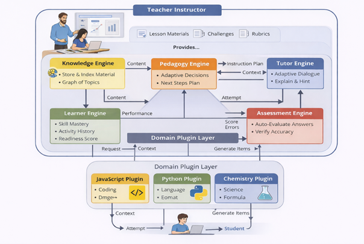

# ITS - Intelligent Tutoring System

**ITS (Intelligent Tutoring System)** is a comprehensive, adaptive educational ecosystem designed to simulate a one-on-one tutoring experience. Unlike static learning platforms or simple API wrappers, ITS features a **custom-built, trainable AI model** at its core. This proprietary model is fine-tuned on educational datasets to master pedagogical strategies, ensuring content, strategy, and feedback are dynamically tailored to each learner's unique needs.

The system empowers **Teachers** to upload raw materials (Lessons, Challenges, Rubrics), which the system's "Brain" then processes to drive an adaptive learning journey for the **Student**.

---

## 🏗️ Architecture & Core Engines

The system is built around five interacting intelligent engines that work together to deliver personalized education.



### System Architecture Diagram

```mermaid
graph TD
    subgraph "Instructor Zone"
        Teacher([👩‍🏫 Teacher])
        Materials[/📄 Lessons & Rubrics/]
        Teacher -->|Uploads| Materials
    end

    subgraph "ITS Core (The AI Brain)"
        direction TB
        KE[🗂️ Knowledge Engine]
        PE[🧠 Pedagogy Engine]
        LE[� Learner Engine]
        TE[� Tutor Engine]
        AE[✅ Assessment Engine]

        Materials -->|Ingest| KE
        KE -->|Context| PE
        LE -->|State| PE
        PE -->|Strategy| TE
        AE -->|Feedback| LE
    end

    subgraph "Domain Layer"
        PluginInterface[[🔌 Plugin Interface]]
        Subjects[📚 Subject Plugins<br/>(Python, Math, History...)]
        PluginInterface --- Subjects
    end

    subgraph "Student Zone"
        Student([👨‍🎓 Student])
    end

    %% Wiring
    PE -->|Directs| PluginInterface
    AE -->|Evaluates| PluginInterface
    
    TE <-->|Chat & Hints| Student
    Student -->|Attempts| AE
```

---

## 🧩 Engine Descriptions

1.  **🗂️ Knowledge Engine**
    *   **Role:** The librarian and map-maker.
    *   **Function:** Ingests raw materials (PDFs, text), chunks them into learnable units, and builds a **Knowledge Graph** linking concepts together.

2.  **🧠 Pedagogy Engine**
    *   **Role:** The strategist.
    *   **Function:** Decides *what* to teach next based on the student's current state. It balances challenge and skill (Vygotsky's Zone of Proximal Development).

3.  **💬 Tutor Engine**
    *   **Role:** The conversationalist.
    *   **Function:** Generates natural language explanations, hints, and encouragement using LLMs (e.g., Llama 3). It adapts the tone and depth of explanation.

4.  **📈 Learner Engine**
    *   **Role:** The memory.
    *   **Function:** Tracks the student's "Mastery Score" for every skill, records activity history, and calculates readiness for new topics.

5.  **✅ Assessment Engine**
    *   **Role:** The grader.
    *   **Function:** Automatically evaluates student answers (code, text, or multiple choice), identifies specific error types, and provides immediate feedback.

---

## 🚀 Key Features

### 1. Dynamic Course Creation
Courses are created dynamically via API. The **Domain Plugin Layer** ensures the system can switch "brains" instantly:
- **Endpoint:** `POST /courses/`
- **Examples:** "Python 101", "History of Art", "Quantum Physics".

### 2. Universal Learning Module (`GenericPlugin`)
This module acts as the default adapter for new subjects. It uses the **Knowledge Engine** to perform RAG (Retrieval-Augmented Generation) on uploaded materials, allowing the system to teach subjects it wasn't explicitly programmed for.

---

## 🛠️ How to Run

### 1. Start the System
Use Docker to launch the entire stack (DB, API, AI):

```bash
docker-compose up -d --build
```

### 2. Verify System (Automated)
Run the verification script to simulate a full usage cycle:
1. Registers a Teacher.
2. Creates a "Python 101" course.
3. Uploads course materials (simulation).
4. Logs in as a Student and asks a question.

```bash
python scripts/verify_trainable.py
```

### 3. Manual API Usage (Swagger UI)
Access the interactive API documentation at `http://localhost:8000/docs`.

1. **Authorize** (Login).
2. `POST /courses/` -> Create a new course.
3. `POST /courses/{id}/upload` -> Upload learning materials.
4. `POST /sessions/` -> Start a session with the Course ID.
5. `POST /chat/` -> Interact with the AI Tutor.
