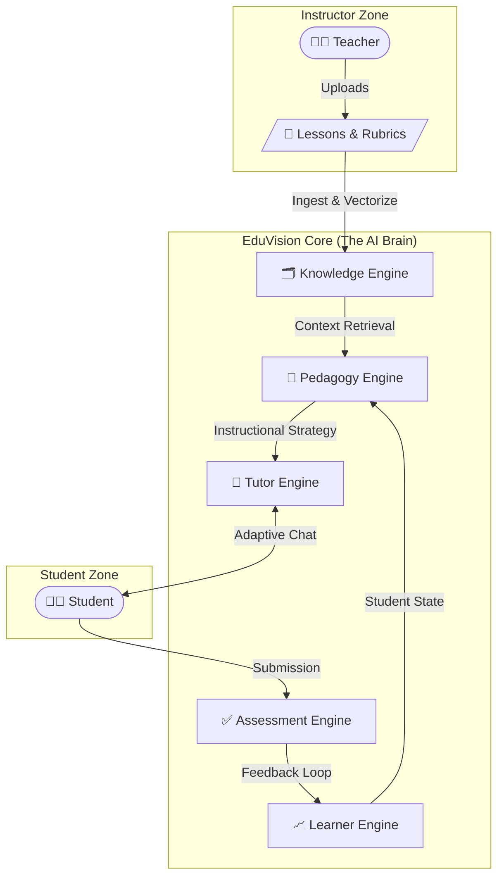

# Adaptive Intelligent Tutoring System

**EduVision** is a next-generation adaptive educational platform designed to simulate a one-on-one human tutoring experience. It leverages advanced AI, cognitive science principles, and dynamic knowledge graphs to provide personalized learning paths for every student.


## 🚀 Core Technology & AI Model
At the heart of EduVision lies a **custom-integrated AI architecture**. Unlike simple wrappers, this system combines the generative power of Large Language Models with the structured precision of Knowledge Graphs and Vector Search.

*   **LLM Engine:** Meta Llama 3.1 (8B Instruct Turbo) via Together AI
*   **Vector Database:** PostgreSQL + pgvector (High-performance vector similarity search)
*   **Embeddings:** sentence-transformers/all-MiniLM-L6-v2
*   **Architecture:** Hybrid Neuro-Symbolic (Generative AI + Deterministic Pedagogy)

---

## 🧠 System Architecture: The 5-Engine Design

The system is built around five interacting intelligent engines that work in harmony to deliver a seamless educational experience.



### Engine Breakdown

1.  **🗂️ Knowledge Engine (RAG + Graph)**
    *   **Function:** Ingests raw educational materials (text, PDFs), chunks them into semantic units, and creates vector embeddings for retrieval. It acts as the system's "Long-Term Memory".
    
2.  **🧠 Pedagogy Engine (The Strategist)**
    *   **Function:** Determines *what* to teach next and *how* to teach it based on the student's real-time performance.
    *   **Strategies:**
        *   **Socratic Method:** Guiding students with questions rather than answers.
        *   **Scaffolding:** Breaking down complex problems into manageable steps.
        *   **Feynman Technique:** Asking students to explain concepts simply to diagnose gaps.

3.  **💬 Tutor Engine (The Persona)**
    *   **Function:** The interface between the AI and the student. It generates natural, empathetic, and context-aware responses using the Llama 3.1 model, tailored by the Pedagogy Engine's strategy.

4.  **📈 Learner Engine (The Tracker)**
    *   **Function:** Maintains a dynamic model of the student's knowledge state (Mastery Score), tracking progress across different skills and concepts over time.

5.  **✅ Assessment Engine (The Evaluator)**
    *   **Function:** Automatically grades student responses (open-ended text or code) against rubrics, providing immediate, constructive feedback and updating the Learner Engine.

---

## 🛠️ Installation & Setup

### Prerequisites
*   Docker & Docker Compose
*   Python 3.11+ (for local development)

### Quick Start (Docker)
The easiest way to run EduVision is using Docker Compose, which sets up the API, PostgreSQL (with pgvector), and all dependencies automatically.

```bash
# 1. Clone the repository
git clone https://github.com/your-repo/eduvision.git
cd eduvision

# 2. Configure Environment
# Rename .env.example to .env and add your API keys (Together AI)

# 3. Launch System
docker-compose up -d --build
```

The API will be available at `http://localhost:8000`.

### Manual Development Setup

```bash
# Create virtual environment
python -m venv venv
source venv/bin/activate  # or venv\Scripts\activate on Windows

# Install dependencies
pip install -r requirements.txt

# Run Database Migrations (if needed)
# python src/db/init_db.py

# Start Server
uvicorn src.api.main:app --reload
```

---

## 📚 API & Technical Documentation

EduVision provides a fully interactive Swagger UI for testing and integration.

**API Playground:** `http://localhost:8000/docs`

For detailed architectural and technical documentation, please refer to the **[Official Documentation](./website/docs/intro.md)** or view the `website/docs` folder.

### Key Endpoints
*   `POST /courses/` - Create a new adaptive course.
*   `POST /courses/{id}/upload` - Upload knowledge materials (PDF/Text) for RAG.
*   `POST /sessions/` - Start a new learning session for a student.
*   `POST /chat/` - Interact with the AI Tutor (Main interaction loop).
*   `GET /learner/{id}/state` - Retrieve current student mastery levels.

---

## 🔮 Roadmap & Future Features

*   **Multi-Modal Support:** Integration of Voice (Whisper) and Image recognition for richer interaction.
*   **Advanced Analytics Dashboard:** Real-time visualization of student progress for teachers.
*   **Reinforcement Learning:** Optimizing pedagogical strategies based on long-term student success rates.

---

*EduVision is a research-driven project focused on democratizing personalized education through Artificial Intelligence.*
