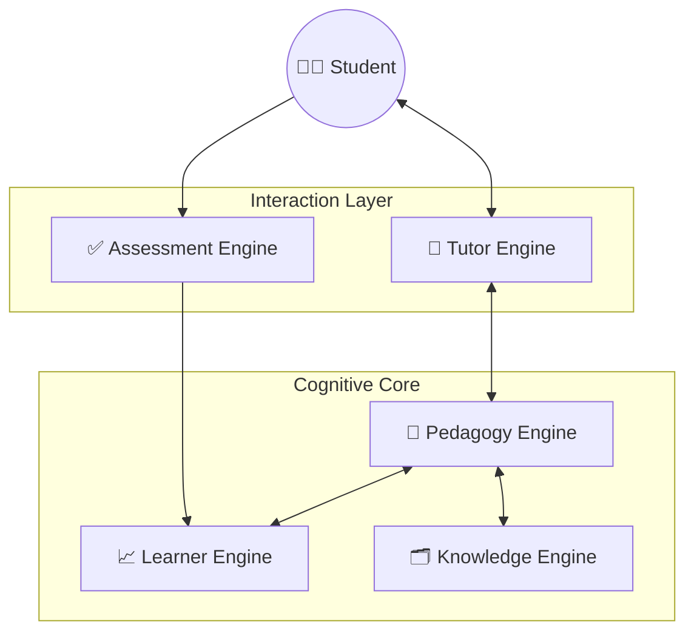

# System Architecture Overview

## The Neuro-Symbolic Approach

EduVision ITS represents a significant leap forward in educational technology by adopting a **Neuro-Symbolic AI Architecture**. Unlike traditional systems that rely solely on heuristic rules (Symbolic) or purely on black-box Large Language Models (Neural), EduVision synthesizes both approaches to achieve:

1.  **Precision & Control:** Symbolic logic (Knowledge Graphs, BKT) ensures the system follows pedagogical rules and tracks mastery accurately.
2.  **Flexibility & Empathy:** Neural networks (LLMs via Together AI) provide natural language understanding, dynamic explanation generation, and conversational adaptability.

## The 5-Engine Core

The system is composed of five distinct, decoupled engines that interact asynchronously.

### 1. 🗂️ Knowledge Engine (The "Cortex")
*   **Responsibility:** Stores and retrieves domain knowledge.
*   **Technology:** **PostgreSQL + pgvector** (for semantic search) + Knowledge Graph (for structural relationships).
*   **Function:** It ingests raw content (PDFs, text), chunks them into learnable units, and generates embeddings using `sentence-transformers/all-MiniLM-L6-v2`. It powers the RAG (Retrieval-Augmented Generation) pipeline.

### 2. 🧠 Pedagogy Engine (The "Strategist")
*   **Responsibility:** Decision making.
*   **Technology:** Reinforcement Learning / Rule-Based Heuristics (Vygotsky's ZPD).
*   **Function:** It decides *what* to teach next. It balances the difficulty of the material against the student's current ability level to maintain flow. Strategies include Socratic questioning, Scaffolding, and Feynman techniques.

### 3. 📈 Learner Engine (The "Hippocampus")
*   **Responsibility:** Long-term memory and state tracking.
*   **Technology:** Bayesian Knowledge Tracing (BKT) + Spaced Repetition (SRS).
*   **Function:** It maintains a probabilistic model of the student's mastery for every concept. It predicts forgetting curves and schedules reviews, persisting state in PostgreSQL.

### 4. 💬 Tutor Engine (The "Voice")
*   **Responsibility:** Natural language generation.
*   **Technology:** **Meta Llama 3.1 (8B Instruct Turbo)** via Together AI API.
*   **Function:** It translates the Pedagogy Engine's strategy into human-like dialogue. It can explain, hint, encourage, and question the student using Socratic methods. It is strictly prompted to be an educational guide, not just a chatbot.

### 5. ✅ Assessment Engine (The "Judge")
*   **Responsibility:** Evaluation and feedback.
*   **Technology:** AST Analysis (for Code), Semantic Similarity (for Text), LLM-based Grading.
*   **Function:** It grades student inputs (code, essays, answers) objectively and provides structured feedback to the Learner Engine.

## Data Flow Lifecycle

1.  **Ingestion:** Teacher uploads material -> Knowledge Engine structures it & Vectorizes it.
2.  **Session Start:** Student logs in -> Learner Engine retrieves profile -> Pedagogy Engine selects initial topic.
3.  **Interaction:** Tutor Engine presents topic -> Student responds.
4.  **Assessment:** Assessment Engine evaluates response -> Updates Learner Engine.
5.  **Adaptation:** Learner Engine updates mastery -> Pedagogy Engine adjusts strategy (e.g., move to next topic or remediate).
