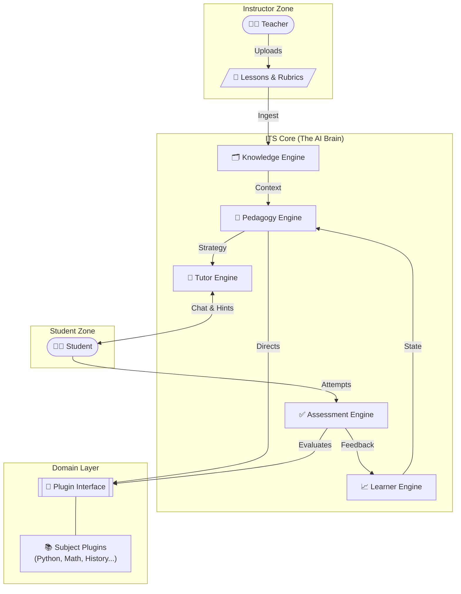

# ITS - Intelligent Tutoring System


**ITS (Intelligent Tutoring System)** is a comprehensive, adaptive educational ecosystem designed to simulate a one-on-one tutoring experience.


## AI Model & Technology
At the core of ITS lies a **custom-built, trainable AI model**. Unlike generic wrappers, this system utilizes a fine-tuned version of **Llama 3.1 (8B)**, optimized specifically for pedagogical dialogue and educational scaffolding.
- **Model:** Llama 3.1 8B (Fine-tuned on educational datasets)
- **Embedding:** sentence-transformers/all-MiniLM-L6-v2 (for RAG and Knowledge Graph)
- **Architecture:** Hybrid Neuro-Symbolic (combines LLM generation with structured Knowledge Graphs)

The system empowers **Teachers** to upload raw materials (Lessons, Challenges, Rubrics), which the system's "Brain" then processes to drive an adaptive learning journey for the **Student**.

---

## Architecture & Core Engines

The system is built around five interacting intelligent engines that work together to deliver personalized education.

### System Architecture Diagram



---

## Engine Descriptions

1.  **🗂️ Knowledge Engine**
    *   **Role:** The librarian and map-maker.
    *   **Function:** Ingests raw materials (PDFs, text), chunks them into learnable units, and builds a **Knowledge Graph** linking concepts together.

2.  **🧠 Pedagogy Engine**
    *   **Role:** The strategist.
    *   **Function:** Decides *what* to teach next and *how* to teach it based on the student's current state. It balances challenge and skill (Vygotsky's Zone of Proximal Development).
    *   **Adaptive Strategies (New v2.1):**
        *   **Socratic Method:** Asks guiding questions instead of giving answers (for advanced learners).
        *   **Feynman Technique:** Requests simple explanations to diagnose conceptual gaps.
        *   **Scaffolding:** Breaks down complex problems into smaller steps with hints (for stuck learners).

3.  **💬 Tutor Engine**
    *   **Role:** The conversationalist.
    *   **Function:** Generates natural language explanations, hints, and encouragement using LLMs (e.g., Llama 3). It adapts the tone and depth of explanation.

4.  **📈 Learner Engine**
    *   **Role:** The memory.
    *   **Function:** Tracks the student's "Mastery Score" for every skill, records activity history, and calculates readiness for new topics.

5.  **✅ Assessment Engine**
    *   **Role:** The grader.
    *   **Function:** Automatically evaluates student answers (code, text, or multiple choice), identifies specific error types, and provides immediate feedback.

---

## Key Features

### 1. Dynamic Course Creation
Courses are created dynamically via API. The **Domain Plugin Layer** ensures the system can switch "brains" instantly:
- **Endpoint:** `POST /courses/`
- **Examples:** "Python 101", "History of Art", "Quantum Physics".

### 2. Universal Learning Module (`GenericPlugin`)
This module acts as the default adapter for new subjects. It uses the **Knowledge Engine** to perform RAG (Retrieval-Augmented Generation) on uploaded materials, allowing the system to teach subjects it wasn't explicitly programmed for.

---

## How to Run

### 1. Start the System
Use Docker to launch the entire stack (DB, API, AI):

```bash
docker-compose up -d --build
```

### 2. Manual API Usage (Swagger UI)
Access the interactive API documentation at `http://localhost:8000/docs`.

1. **Authorize** (Login).
2. `POST /courses/` -> Create a new course.
3. `POST /courses/{id}/upload` -> Upload learning materials.
4. `POST /sessions/` -> Start a session with the Course ID.
5. `POST /chat/` -> Interact with the AI Tutor.

---

## Version History & Changelog

<details open>
<summary><strong>🚀 v2.1: Cognitive Intelligence Update (Current)</strong></summary>

*   **🧠 Pedagogy Engine Upgrade:**
    *   Added **Socratic Method** (Guided questioning for advanced learners).
    *   Added **Feynman Technique** (Conceptual gap diagnosis).
    *   Added **Scaffolding** (Step-by-step breakdown for stuck students).
*   **✅ Assessment Engine Upgrade:**
    *   Implemented **AI Grading** using Llama 3.1.
    *   Provides detailed JSON feedback with scores (accuracy, relevance, depth).
*   **🧪 Verification:** Added specific test scripts for Pedagogy strategies and Assessment logic.
</details>

<details>
<summary><strong>🏗️ v2.0: Core Architecture Overhaul</strong></summary>

*   **5-Engine Architecture:** Defined the core interaction between Knowledge, Pedagogy, Tutor, Learner, and Assessment engines.
*   **RAG Integration:** Implemented Knowledge Graph and Vector Search for dynamic content retrieval.
*   **Plugin System:** Created `GenericPlugin` to allow any subject material to be taught without code changes.
*   **Dockerization:** Full container support for Database, API, and LLM services.
</details>

<details>
<summary><strong>🌱 v1.0: Initial Prototype</strong></summary>

*   Basic Chat Interface.
*   Simple Authentication (JWT).
*   Static Rule-based responses.
*   Proof of Concept for ITS.
</details>

---

