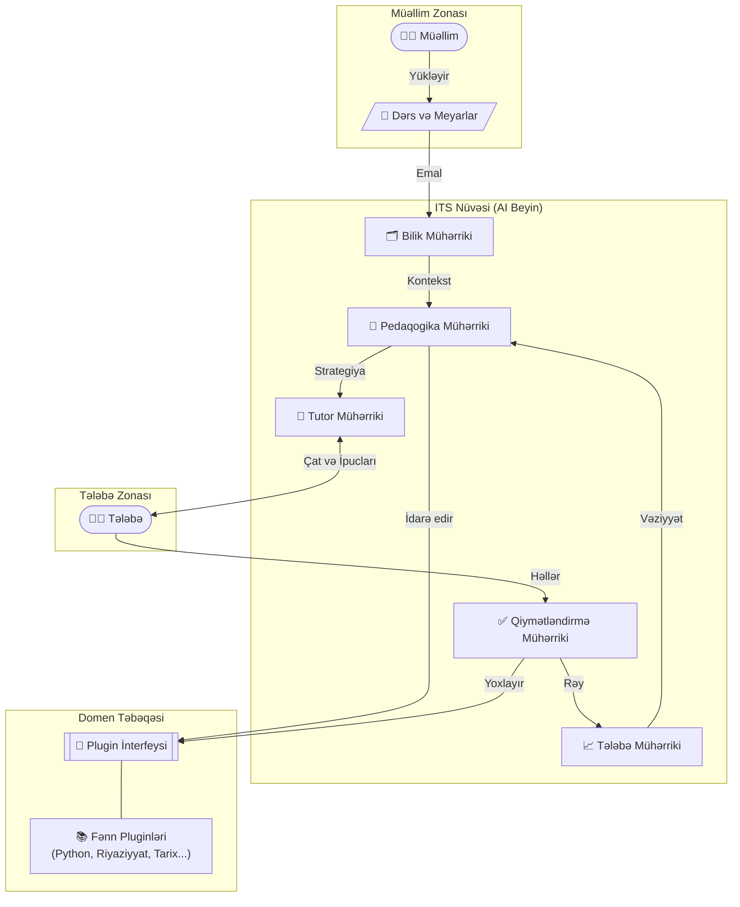

# ITS - İntellektual Tədris Sistemi

**ITS (Intelligent Tutoring System - İntellektual Tədris Sistemi)**, fərdi tədris təcrübəsini simulyasiya etmək üçün dizayn edilmiş hərtərəfli, adaptiv bir təhsil ekosistemidir.

---

## 📅 Versiya Tarixçəsi və Yeniliklər

<details open>
<summary><strong>🚀 v2.1: Koqnitiv İntellekt Yenilənməsi (Hazırkı)</strong></summary>

*   **🧠 Pedaqogika Mühərriki Yenilənməsi:**
    *   **Sokrat Metodu:** Təfəkkürü inkişaf etdirmək üçün yönləndirici suallar.
    *   **Feynman Texnikası:** Konseptual boşluqları tapmaq üçün sadə izah tələbi.
    *   **Scaffolding (Dəstək):** Çətin tapşırıqların kiçik addımlara bölünməsi.
*   **✅ Qiymətləndirmə Mühərriki:**
    *   Llama 3.1 ilə **AI Qiymətləndirmə**.
    *   Dəqiqlik, uyğunluq və dərinlik üzrə ətraflı JSON rəylər.
*   **🧪 Verifikasiya:** Strategiyalar üçün xüsusi test skriptləri əlavə edildi.
</details>

<details>
<summary><strong>🏗️ v2.0: Əsas Arxitektura Dəyişikliyi</strong></summary>

*   **5-Mühərrik Arxitekturası:** Bilik, Pedaqogika, Tutor, Tələbə və Qiymətləndirmə mühərriklərinin qarşılıqlı əlaqəsi quruldu.
*   **RAG İnteqrasiyası:** Dinamik məzmun axtarışı üçün Bilik Qrafı və Vektor Axtarışı.
*   **Plugin Sistemi:** İstənilən fənnin kod dəyişikliyi olmadan öyrədilməsi üçün `GenericPlugin`.
*   **Dockerization:** Verilənlər bazası, API və AI xidmətləri üçün konteyner dəstəyi.
</details>

<details>
<summary><strong>🌱 v1.0: İlkin Prototip</strong></summary>

*   Sadə Çat İnterfeysi.
*   Autentifikasiya (JWT).
*   Statik Qayda-əsaslı cavablar.
</details>

---

## 🤖 AI Model və Texnologiya
ITS-in nüvəsində **xüsusi olaraq hazırlanmış və təlimləndirilən AI modeli** dayanır. Sadə API qabıqlarından (wrappers) fərqli olaraq, bu sistem pedaqoji dialoq və tədris dəstəyi üçün optimallaşdırılmış **Llama 3.1 (8B)** modelinin incə-tənzimlənmiş (fine-tuned) versiyasından istifadə edir.
- **Model:** Llama 3.1 8B (Təhsil verilənləri üzərində fine-tune olunub)
- **Embedding:** sentence-transformers/all-MiniLM-L6-v2 (RAG və Bilik Qrafı üçün)
- **Memarlıq:** Hibrid Neyro-Simvolik (LLM generasiyasını strukturlaşdırılmış Bilik Qrafları ilə birləşdirir)

Sistem **Müəllimlərə** materialları (Dərslər, Tapşırıqlar, Meyarlar) yükləmək imkanı verir, sistemin "Beyni" isə bu materialları emal edərək **Tələbə** üçün adaptiv öyrənmə səyahətini idarə edir.

---

## 🏗️ Memarlıq və Əsas Mühərriklər

Sistem, fərdiləşdirilmiş təhsil təqdim etmək üçün birlikdə işləyən beş qarşılıqlı əlaqəli intellektual mühərrik ətrafında qurulmuşdur.

### Sistem Memarlığı Diaqramı



---

## 🧩 Mühərriklərin İzahı

1.  **🗂️ Bilik Mühərriki (Knowledge Engine)**
    *   **Rolu:** Kitabxanaçı və xəritəçəkən.
    *   **Funksiyası:** Xam materialları (PDF, mətn) qəbul edir, onları öyrənilə bilən hissələrə (chunks) bölür və konseptləri bir-birinə bağlayan **Bilik Qrafı** qurur.

2.  **🧠 Pedaqogika Mühərriki (Pedagogy Engine)**
    *   **Rolu:** Stratq.
    *   **Funksiyası:** Tələbənin cari vəziyyətinə əsasən növbəti addımda *nəyin* və *necə* öyrədiləcəyinə qərar verir. Çətinlik və bacarıq arasında balansı qoruyur (Viqotskinin Yaxın İnkişaf Zonası).
    *   **Adaptiv Strategiyalar (Yeni v2.1):**
        *   **Sokrat Metodu:** Birbaşa cavab vermək əvəzinə, yönləndirici suallar verir (güclü tələbələr üçün).
        *   **Feynman Texnikası:** Konseptual boşluqları tapmaq üçün tələbədən sadə izah tələb edir.
        *   **Scaffolding (Dəstək):** Çətin problemləri kiçik addımlara bölür və ipucları verir (ilişib qalanlar üçün).

3.  **💬 Tutor Mühərriki (Tutor Engine)**
    *   **Rolu:** Həmsöhbət.
    *   **Funksiyası:** LLM-lərdən (məsələn, Llama 3) istifadə edərək təbii dildə izahlar, ipucları və həvəsləndirmə yaradır. İzahın tonunu və dərinliyini uyğunlaşdırır.

4.  **📈 Tələbə Mühərriki (Learner Engine)**
    *   **Rolu:** Yaddaş.
    *   **Funksiyası:** Hər bir bacarıq üzrə tələbənin "Mənimsəmə Xalını" izləyir, fəaliyyət tarixçəsini qeyd edir və yeni mövzular üçün hazırlığı hesablayır.

5.  **✅ Qiymətləndirmə Mühərriki (Assessment Engine)**
    *   **Rolu:** Qiymətləndirən.
    *   **Funksiyası:** Tələbənin cavablarını (kod, mətn və ya çoxseçimli test) avtomatik qiymətləndirir, xüsusi səhv növlərini müəyyən edir və dərhal rəy bildirir.

---

## 🚀 Əsas Xüsusiyyətlər

### 1. Dinamik Kurs Yaradılması
Kurslar API vasitəsilə dinamik olaraq yaradılır. **Domen Plugin Təbəqəsi** sistemin "beynini" dərhal dəyişə bilməsini təmin edir:
- **Endpoint:** `POST /courses/`
- **Nümunələr:** "Python 101", "İncəsənət Tarixi", "Kvant Fizikası".

### 2. Universal Öyrənmə Modulu (`GenericPlugin`)
Bu modul yeni fənlər üçün standart adapter rolunu oynayır. O, **Bilik Mühərriki**ndən istifadə edərək yüklənmiş materiallar üzərində RAG (Məlumat-Dəstəkli Generasiya) həyata keçirir və sistemə əvvəlcədən proqramlaşdırılmamış fənləri tədris etməyə imkan verir.

---

## 🛠️ Necə İşə Salmaq Olar

### 1. Sistemi Başlatmaq
Bütün sistemi (DB, API, AI) işə salmaq üçün Docker istifadə edin:

```bash
docker-compose up -d --build
```

### 2. Sistemi Yoxlamaq (Avtomatlaşdırılmış)
Tam istifadə dövrünü simulyasiya etmək üçün yoxlama skriptini işə salın:
1. Müəllim qeydiyyatdan keçir.
2. "Python 101" kursu yaradır.
3. Kurs materiallarını yükləyir (simulyasiya).
4. Tələbə kimi daxil olur və sual verir.

```bash
python scripts/verify_trainable.py
```

### 3. Manual API İstifadəsi (Swagger UI)
İnteraktiv API sənədləşməsinə `http://localhost:8000/docs` ünvanından daxil olun.

1. **Authorize** (Giriş edin).
2. `POST /courses/` -> Yeni kurs yaradın.
3. `POST /courses/{id}/upload` -> Tədris materiallarını yükləyin.
4. `POST /sessions/` -> Kurs ID-si ilə sessiya başladın.
5. `POST /chat/` -> AI Müəllimlə ünsiyyət qurun.
